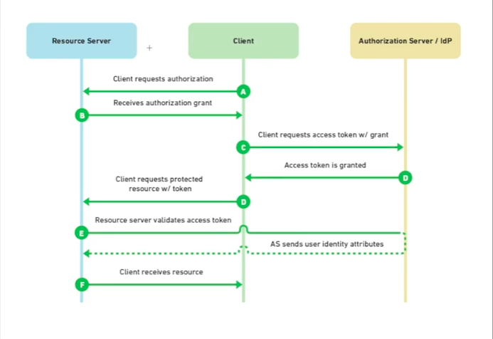
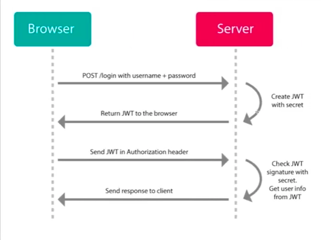
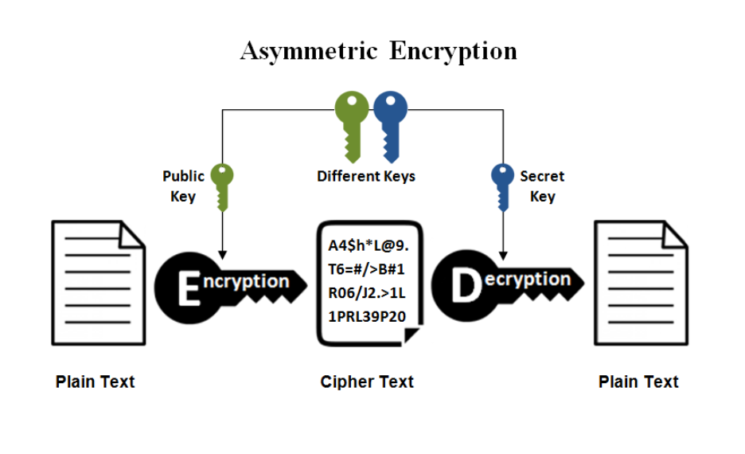
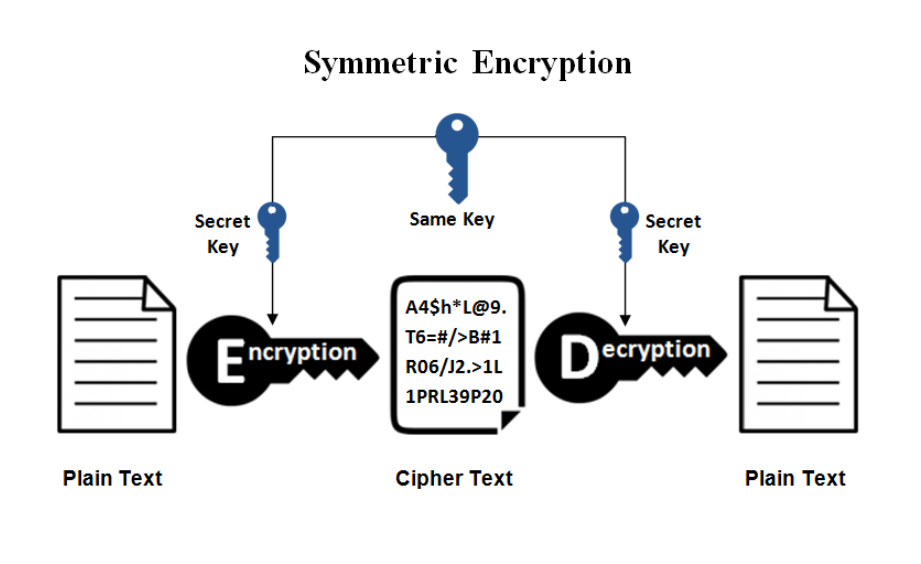

## Terminology
Authentication (tokens)
: The process of ascertaining that somebody really is who they claim to be.

Authorization (keys)
: Refers to rules that determine who is allowed to do what. E.g. Adam may be authorized to create and delete databases, while Usama is only authorized to read.

Source: [Authentication versus Authorization](https://stackoverflow.com/questions/6556522/authentication-versus-authorization) on Stack Overflow

## Common types of encryption schemes
### API Keys
- Is an authorization scheme that does not authenicate the user.
- Used by developers to access secure APIs. 
- An API key is considered public and is inherently insecure.
- The general process for creating a key:
    1. Login to the service portal.
    2. Find/generate your API key. This is usually under Settings or similar.
    3. Copy your API key into your application.
    4. Follow the instructions provided by the service to test your API key.

### OAuth2
- An authentication standard that grants access to user data using an independent identity provider (IDP).
- Advantages over API keys:
    - Access tokens can be tied to particular scopes, which restrict the types of operations and data the application can access
    - Combined with refresh tokens, access tokens will expire, so the negative effects could have a limited impact.
    - Even if refresh tokens aren’t used, access tokens can still be revoked.

### JSON Web Tokens (JWT)
- JWTs can be used for other purposes than API access.
- Is a token scheme that can be used in combination with OAuth.
- Advantage: a JWT can store any type of data, thereby reducing the number of database calls.

### Asymmetric Key Encryption (RSA)
- Also called Public Key Encryption 
- 2 keys are needed:
  - Public key - known by everyone (generally used for encryption) 
  - Private key - known only by the owner (generally used for decryption)
- Used a lot for APIs. Keeping the private key hidden and out of repositories is important.

### Symmetry Key Encryption
- Also called Secret Key Encryption
- Same key used to encrypt and dycrypt data. The key is blended with the message in a particular way.
- Transer of the key is an issue
  - Both the sender and receiver need the same key
  - Should be changed frequently to ensure no "leaks" 
- Faster than asymmetric encryption
- Best for a limited number of users exchanging information

## Attributions
- [Why and when to use API keys](https://cloud.google.com/endpoints/docs/openapi/when-why-api-key)
- [API Keys vs OAuth Tokens vs JSON Web Tokens](https://zapier.com/engineering/apikey-oauth-jwt/)
- [OAuth Vs JWT | What is the difference?](https://www.youtube.com/watch?v=a9R3Gq1BKxI)